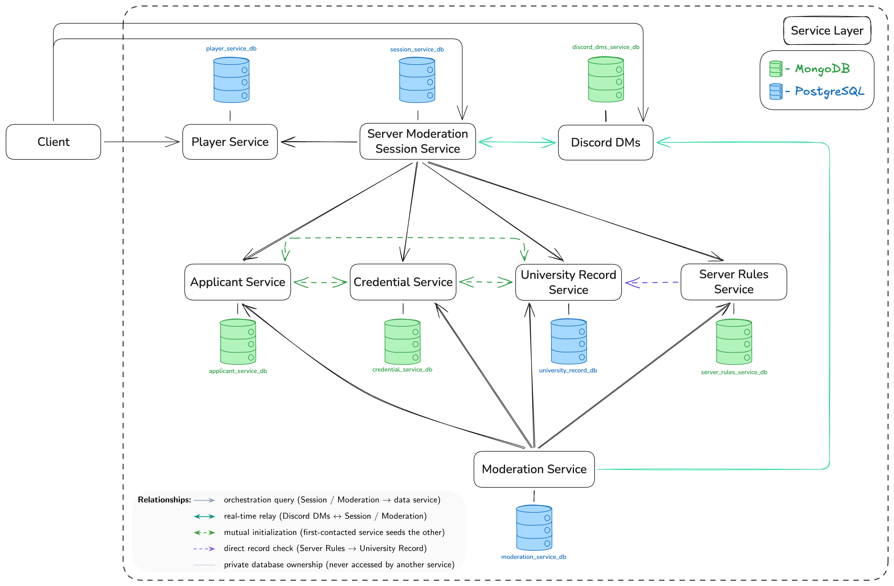

# Student ID, Please — PAD Project (Topic 3)

Team 18

## Table of Contents

- [Overview](#overview)
- [Team](#team)
- [Service Boundaries](#service-boundaries)
- [Architecture Diagram](#architecture-diagram)
- [Tech Stack & Communication Patterns](#tech-stack--communication-patterns)
- [Communication Contract](#communication-contract)
- [Development Guidelines](#development-guidelines)
- [Microservice Repositories](#microservice-repositories)
- [Project Board](#project-board)

## Overview

A Discord-server-moderation game: applicants (students, professors, alumni, outsiders — some presenting false credentials) attempt to join the university server each round. A moderation team of players must consult university records, verify credentials, check current server rules, and communicate findings before deciding to Accept, Reject, Flag, or Ban.

## Team

| Name | Group | Service 1 | Service 2 |
|---|---|---|---|
| [Mihaela Untu](https://github.com/mihaelaaa-23) | FAF-232 | Player Service | Server Moderation Session Service |
| [Ciprian Moisenco](https://github.com/ciprik13) | FAF-232 | Applicant Service | Credential Service |
| [Ion Iamandii](https://github.com/ion190) | FAF-233 | Server Rules Service | University Record Service |
| [Liviu Chirtoaca](https://github.com/D3adeYe69) | FAF-233 | Moderation Service | Discord DMs Service |


## Service Boundaries

> One subsection per service. Each should describe what it owns, what it manages, and what it deliberately does NOT own.

### Player Service

Responsible for the identity and progression of the players who take part in moderation shifts. It owns player accounts, authentication credentials, and public profiles (moderator handle, avatar), along with the player's friends list used to team up before a shift. It also owns XP and leveling — players gain experience from completed shifts, correct decisions, and any disciplinary actions taken against them, and level up over time based on this history.

**Database:** PostgreSQL (`player_service_db`) — player accounts, credentials, and XP/level history are relational and benefit from foreign-key integrity between players and their friends list.

Player Service does **not** own any moderation-session state (that belongs to Server Moderation Session Service), nor any information about the applicants trying to join the Discord server (owned by Applicant Service). It communicates with Server Moderation Session Service to let players join available sessions and receives shift results at the end of each session to update XP and levels accordingly.

### Server Moderation Session Service

Owns the lifecycle of an active moderation shift — one Moderator plus several Junior Moderators working a shift together. It is responsible for creating and joining sessions, assigning the Moderator/Junior Moderator roles, and starting/ending shifts. It tracks the current applicant being reviewed, how many applications have been processed so far, and a running session score with any penalties incurred during the shift. At the end of a shift, it determines the overall session result and publishes it so Player Service can update player progression.

**Database:** PostgreSQL (`session_service_db`) — session/shift records are structured and short-lived, with clear relational links between a session, its participants, and its running score.

This service does **not** store any persistent player data (accounts, XP, friends — that's Player Service), nor does it own applicant, credential, or rule data. It coordinates a shift by pulling in information from Applicant Service, Credential Service, Server Rules Service, and University Record Service as each applicant comes through.

### Applicant Service

Owns the people attempting to access the Discord server. It generates applicants with attributes such as name, student ID, major, year, university status, courses, and role (FAF student, student of another faculty, teaching assistant, staff, alumnus, or outsider). Some applicants are deliberately generated with false information or as impersonation attempts. If it's the first service contacted for a new applicant, it initializes that applicant's profile and propagates the relevant data to Credential Service and University Record Service; otherwise, it builds its own record from whichever service initialized the applicant first.

**Database:** MongoDB (`applicant_service_db`) — applicant profiles vary in shape by role (student vs. outsider vs. alumnus), which suits a flexible document schema better than a fixed relational one.

It does **not** own credential documents (Credential Service) or hidden university records (University Record Service), and it does **not** decide whether an applicant is admitted (Moderation Service).

### Credential Service

Owns the documents and credentials an applicant presents — student ID, university email, enrollment confirmation, course registration, and similar. Credentials can be expired, forged, inconsistent, or incomplete. It validates the structure and authenticity of what's presented, but it does not decide whether the applicant should be let in. Like Applicant Service, whichever of the two is contacted first for a new applicant initializes the shared data and propagates it to the other.

**Database:** MongoDB (`credential_service_db`) — credential documents differ by type (ID card, email confirmation, enrollment letter) and are naturally stored as loosely-structured documents rather than fixed columns.

It does **not** own the applicant's general profile (Applicant Service) or the actual admission decision (Moderation Service).

### Server Rules Service

Owns the current access rules for the Discord server — rules that can change between shifts and grow arbitrarily complex (e.g. "only FAF students may join," "first-years can't access certain channels," "previously banned students are never re-admitted"). Its core job is evaluating a given applicant against whatever the current rule set is.

**Database:** MongoDB (`server_rules_service_db`) — rules are arbitrarily nested conditions that don't map cleanly to fixed columns, so a document store keeps rule definitions flexible as they grow more complex.

It does **not** store applicant data itself (Applicant Service), university records (University Record Service), or make the final Accept/Reject/Flag/Ban call (Moderation Service) — it only reports whether an applicant passes or fails the current rules.

### University Record Service

Owns the hidden university information moderators may need to verify an applicant: enrollment lists, Outlook group/email lists, current course catalog, academic year, and semester schedule. This information is deliberately fragmented across Junior Moderator players — one might see the enrollment list, another the message records — and the service must enforce that players can't access records they weren't assigned to see. As with Applicant/Credential Service, whichever service is contacted first for a new applicant initializes the record and propagates it onward.

**Database:** PostgreSQL (`university_records`) — enrollment lists, course catalogs, and semester schedules are inherently relational (students ↔ courses ↔ semesters), and per-field access scoping is easier to enforce with relational constraints.

It does **not** own the applicant's public profile (Applicant Service) or credentials (Credential Service), and it does not enforce server rules itself (Server Rules Service).

### Moderation Service
Owns the actual admission decision for each applicant. The Moderator chooses Accept, Reject, Flag (for further investigation), or Ban, and the service gathers the relevant information from Applicant, Credential, Server Rules, and University Record Services to determine whether the decision was correct under the current rules. It records the applicant, the decision made, any rules violated, penalties applied, and the outcome.

**Database:** PostgreSQL (`moderation_service_db`) — decisions, violated rules, and penalties form a clean relational audit trail tying each decision back to a specific applicant and session.

It does **not** generate or store applicant/credential/record data itself, and it does not handle the real-time communication between players (Discord DMs Service) — it only consumes information and produces a verdict.

### Discord DMs Service

Provides real-time communication between the Moderator and Junior Moderators during a session, through a Discord-like WebSocket interface. It manages channels tied to the current moderation session (e.g. #enrollment-check, #faculty-check, #course-registration, #general-mod-chat), with different players able to access different channels depending on what information they've been assigned.

**Database:** MongoDB (`discord_dms_service_db`) — chat messages and per-session channel membership are naturally document-shaped and high-write, which fits MongoDB's model better than a fixed relational schema.

It transports messages but does **not** determine whether the information shared is correct, and it does not own any applicant, credential, or rule data itself — it's purely the communication layer.

## Architecture Diagram



Services sit inside a single **Service Layer** boundary, with the Client entering only through Player Service (register/login), Server Moderation Session Service (session lifecycle), and Discord DMs (WebSocket channels) — every other service is reached only through Session or Moderation, never directly. Each service's database is drawn as a labeled cylinder next to it, color-coded MongoDB (green) vs. PostgreSQL (blue) per the legend. A second legend explains the line styles: orchestration queries (Session/Moderation calling a data service), the real-time Discord relay, the Applicant/Credential/University-Record mutual-initialization trio, and Server Rules' direct check against University Record.

**Service Relationships**

Server Moderation Session Service acts as the central coordinator during an active shift. It queries Applicant Service for the current applicant, Credential Service to check submitted documents, Server Rules Service to evaluate the applicant against current access rules, and University Record Service to pull any hidden records needed for verification. Once a shift ends, it publishes the result to Player Service so XP and levels can be updated.
This is exposed concretely through `POST /sessions/{id}/process-applicant`, which currently calls mocked versions of these four services and falls back to real HTTP calls once they're deployed and reachable.

Moderation Service independently gathers the same four services — Applicant, Credential, Server Rules, and University Record — to determine whether the Moderator's decision (Accept, Reject, Flag, or Ban) was correct under the current rules. It does not talk to Player Service or Session Service directly; it only consumes applicant-side data to produce a verdict.

Applicant Service, Credential Service, and University Record Service share a mutual initialization pattern: whichever of the three is contacted first for a new applicant creates that applicant's record and propagates the relevant data to the other two. This is why all three are connected to each other rather than routing through a single source of truth.

Server Rules Service and University Record Service communicate directly as well, since rule evaluation can require checking specific university records (e.g. enrollment length, prior ban status) rather than relying only on what the applicant presents.

Discord DMs Service is tied to the active session: it provides the real-time channels (`#enrollment-check`, `#faculty-check`, etc.) that Junior Moderators use to share findings during a shift, and it exchanges session context bidirectionally with Server Moderation Session Service. Moderation Service also communicates with Discord DMs Service, since the Moderator's final decision needs to be relayed back to the team through chat.

Player Service sits at the edge of this graph — it only receives shift outcomes from Session Service and has no direct relationship with the applicant-side services (Applicant, Credential, Server Rules, University Record) or with Moderation Service.

## Tech Stack & Communication Patterns

> Languages used by the team: **Node.js** + **Go**. Note: Python is our team's "banned language" (a language known by everyone on the team, excluded from use in any private microservice per the assignment rules), so it is not used in any service below.

**Node.js**

Used for Player Service, Server Moderation Session Service, Applicant Service, Credential Service, Server Rules Service, and University Record Service. These are CRUD and validation-heavy with no real concurrency needs. Node's flexible object handling fits the loosely-shaped JSON these services pass around, and Express keeps boilerplate low as rules and applicant types keep expanding.

**Go**

Used for Moderation Service and Discord DMs Service. Moderation Service calls four other services per decision and must stay responsive under concurrent sessions — goroutines handle that fan-out cheaply. Discord DMs Service keeps many per-channel WebSocket connections open per shift; Go's goroutine-per-connection model is built for exactly that.

**Databases**

Following the database-per-service rule below, each service picked PostgreSQL or MongoDB based on how structured its own data is, not by matching its language:

| Service | Database | Why |
|---|---|---|
| Player Service | PostgreSQL | Relational links between accounts, friends, XP history |
| Server Moderation Session Service | PostgreSQL | Structured, short-lived session/shift records |
| University Record Service | PostgreSQL | Relational enrollment/course/semester data with field-level access scoping |
| Moderation Service | PostgreSQL | Relational audit trail of decisions and penalties |
| Applicant Service | MongoDB | Applicant shape varies by role (student/alumnus/outsider) |
| Credential Service | MongoDB | Credential documents vary by type |
| Server Rules Service | MongoDB | Arbitrarily nested rule conditions |
| Discord DMs Service | MongoDB | High-write, document-shaped chat messages |

## Communication Contract
 
### Data Management Across Microservices

We use **database-per-service**, not a shared database: each of the 8 services owns one private database (see the **Databases** table above), and no service ever connects to another service's database directly — not even read-only. All cross-service data access is mediated through the owning service's REST API, using the request/response shapes defined in the Endpoints tables below.

This has a few direct consequences for how the system behaves:

- **No shared schema.** Applicant, Credential, and University Record Service each store only the fields relevant to their own concern (profile data, documents, hidden records respectively) rather than one team owning a combined "applicant" table others read from. This is why Server Rules Service can't just query enrollment data directly — it has to ask University Record Service for it over the network.
- **Mutual initialization instead of a single source of truth.** Applicant, Credential, and University Record Service can each be the *first* service contacted about a new applicant. Whichever one is first creates that applicant's record and pushes the relevant subset of data to the other two over their APIs. This avoids a single owning service becoming a bottleneck, at the cost of each of the three needing to handle "applicant already exists, sync my copy" as a real code path — not just "create new."
- **Read-heavy orchestration, not a shared cache.** Session Service and Moderation Service don't hold their own copies of applicant/credential/rule/record data — every shift and every decision re-queries the four data services live. We're intentionally trading a bit of latency for never having stale applicant data during a shift.
- **Eventual, not transactional, consistency.** Because propagation between Applicant/Credential/University Record happens as separate API calls rather than a single database transaction, it's possible for one of the three to succeed and another to fail or lag. For Lab 1 we're accepting this risk rather than introducing a message broker; if this becomes a real problem in testing, promoting the mutual-init calls to an event-driven pattern is the natural next step, but it's out of scope for now.
- **Credentials never travel in the diagram or the repo.** Each service's Docker setup expects DB connection details via environment variables (see each service's own README), and none of those values are committed — only `.env.example` placeholders.
 
### Endpoints
 
#### Player Service
| Method | Path | Request | Response |
|---|---|---|---|
| POST | /players/register | `{username: string, email: string, password: string}` | `{playerId: string, username: string, level: int, xp: int}` |
| POST | /players/login | `{username: string, password: string}` | `{token: string, playerId: string}` |
| GET | /players/{id} | — | `{playerId: string, username: string, level: int, xp: int, friends: string[]}` |
| PATCH | /players/{id}/xp | `{xpGained: int, reason: string}` | `{playerId: string, xp: int, level: int}` |
| DELETE | /players/{id} | — | `{playerId: string, deleted: boolean}` |
 
#### Server Moderation Session Service
| Method | Path | Request | Response |
|---|---|---|---|
| POST | /sessions | `{moderatorId: string, juniorIds: string[]}` | `{sessionId: string, status: string}` |
| POST | /sessions/{id}/join | `{playerId: string, role: string}` | `{sessionId: string, role: string, status: string}` |
| GET | /sessions/{id} | — | `{sessionId: string, currentApplicantId: string, processedCount: int, score: int, status: string}` |
| POST | /sessions/{id}/end | — | `{sessionId: string, result: string, score: int}` |
| POST | /sessions/{id}/process-applicant | — | `{sessionId: string, processedCount: int, currentApplicantId: string, applicant: object, credentialCheck: object, rulesCheck: object, universityRecords: object}` |
 
#### Applicant Service
| Method | Path | Request | Response |
|---|---|---|---|
| POST | /applicants/generate | — | `{applicantId: string, name: string, studentId: string, major: string, year: int\|null, role: string, status: string}` |
| GET | /applicants/{id} | — | `{applicantId: string, name: string, studentId: string, major: string, year: int\|null, role: string, status: string}` |
| GET | /health | — | `{status: "ok"}` |
| GET | /status | — | `{service: string, status: string, database: string, time: string}` — `503` with `status: "degraded"` and `database: "down"` when MongoDB is unreachable |
| POST | /applicants | `{name: string, studentId: string, major: string, year: int\|null, role: string, status: string}` | `201` + `{applicantId: string, name: string, studentId: string, major: string, year: int\|null, role: string, status: string}` |
| GET | /applicants | `?role=string&limit=int&cursor=string` (limit 1-100, default 20) | `{items: [applicant], nextCursor: string\|null}` |
| PATCH | /applicants/{id} | any subset of `{name, major, year, role, status}` | the full applicant shape |
| DELETE | /applicants/{id} | — | `{applicantId: string, deleted: boolean}` |
 
#### Credential Service
| Method | Path | Request | Response |
|---|---|---|---|
| GET | /credentials/{applicantId} | — | `{applicantId: string, studentIdCard: string, universityEmail: string, valid: boolean, issues: string[]}` |
| POST | /credentials/{applicantId}/validate | — | `{applicantId: string, valid: boolean, issues: string[]}` |
| GET | /health | — | `{status: "ok"}` |
| GET | /status | — | `{service: string, status: string, database: string, time: string}` — `503` with `status: "degraded"` and `database: "down"` when MongoDB is unreachable |
| POST | /credentials/{applicantId} | `{core?: {name, studentId, major, year, role, status}, scenario?: string, seed?: int}` | `201` + `{applicantId: string, studentIdCard: string, universityEmail: string, valid: boolean, issues: string[]}` |
| GET | /credentials | `?limit=int&cursor=string` (limit 1-100, default 20) | `{items: [credential], nextCursor: string\|null}` |
| PATCH | /credentials/{applicantId} | any subset of `{holderName, expiresAt, documents}` | the credential shape |
| DELETE | /credentials/{applicantId} | — | `{applicantId: string, deleted: boolean}` |

Notes for callers (Applicant Service, Credential Service):

- `POST /applicants/generate` accepts an optional `?seed=int`. The same seed produces the same applicant, which is what makes the Postman assertions repeatable.
- `core` in `POST /credentials/{applicantId}` is optional. When it is absent, Credential Service fetches the applicant from Applicant Service and answers `404` if that applicant does not exist; it never invents a person.
- `PATCH` never accepts `applicantId` or `studentId`. They are the shared key across Applicant, Credential and University Record, so they are immutable after creation and sending either is `422`.
- `DELETE` is local to the service. It does not cascade to the other two services in Lab 1.
- Errors come back as `{error: {code: string, message: string, details?: object[]}}`, with codes `NOT_FOUND`, `CONFLICT`, `VALIDATION_FAILED`, `INTERNAL_ERROR` and statuses `201` create, `404` unknown id, `409` duplicate id, `422` validation, `500` internal. Discord DMs Service publishes `{error: string}` instead, so the team still has to agree on one shape; this documents what these two services return today rather than deciding it here.
 
#### Server Rules Service

**Base URL:** `http://localhost:3005`

| Method | Endpoint          | Request                       | Response                    |
| ------ | ----------------- | ----------------------------- | --------------------------- |
| `GET`  | `/rules/current`  | —                             | `{ rules: [...] }`          |
| `POST` | `/rules/evaluate` | `{ applicantId, applicant? }` | `{ passed, violatedRules }` |

**##### Evaluate rules**

Example request:

```json
{
  "applicantId": "applicant-001",
  "applicant": {
    "previousBan": false
  }
}
```

The Server Rules Service evaluates all enabled rules stored in MongoDB.

When external-service mode is enabled, the service requests university information from the University Record Service using:

```text
GET /records/{applicantId}?requestingPlayerId=server-rules-service
```

The `applicant` object supplied to `/rules/evaluate` can provide fields directly used by rules. The service can also obtain additional university data from the University Record Service.

The service supports a mock external-service mode through `MOCK_EXTERNAL_SERVICES=true`. This allows rule evaluation to be tested without requiring the University Record Service to be available.

The current Lab 1 rule set includes:

* `ONLY_FAF_STUDENTS` — applicant role must be `student_faf`
* `ACTIVE_STATUS_REQUIRED` — applicant status must be `active`
* `NO_PREVIOUS_BAN` — applicant must not have a previous ban

The Server Rules Service does not make the final admission decision; it only reports whether the enabled rules passed and which rules were violated.


#### University Record Service

**Base URL:** `http://localhost:3006`

| Method   | Endpoint                 | Request                              | Response                    |
| -------- | ------------------------ | ------------------------------------ | --------------------------- |
| `GET`    | `/records`               | —                                    | Array of university records |
| `GET`    | `/records/{applicantId}` | `requestingPlayerId` query parameter | University record           |
| `POST`   | `/records`               | University record JSON               | Created record              |
| `PUT`    | `/records/{applicantId}` | Updated fields                       | Updated record              |
| `DELETE` | `/records/{applicantId}` | —                                    | Deleted record              |

For a specific applicant, `requestingPlayerId` **must be supplied as a query parameter**:

```text
GET /records/applicant-001?requestingPlayerId=player-001
```

A request without `requestingPlayerId` returns HTTP `400`.

Example response:

```json
{
  "id": 1,
  "applicant_id": "applicant-001",
  "student_id": "UTM-2026-001",
  "university": "Technical University of Moldova",
  "faculty": "Faculty of Computers, Informatics and Microelectronics",
  "program": "Software Engineering",
  "study_year": 4,
  "enrollment_status": "active",
  "average_grade": 9.25
}
```

The service uses PostgreSQL with a persistent Docker volume.

 
#### Discord DMs Service
| Method | Path | Request | Response |
|---|---|---|---|
| GET | /status | — | `{service: string, status: string, database: string, time: string}` |
| POST | /sessions/<wbr>{id}/<wbr>bootstrap | — | `201` + `{sessionId: string, created: string[], existing: string[], channels: string[]}` |
| POST | /sessions/<wbr>{id}/<wbr>channels | `{name: string}` | `201` + `{id: string, sessionId: string, name: string, createdAt: string}` |
| GET | /sessions/<wbr>{id}/<wbr>channels | `?playerId=string` (optional) | `{sessionId: string, playerId: string, channels: string[]}` |
| GET | /sessions/<wbr>{id}/<wbr>channels/<wbr>{channel} | — | the channel shape |
| PATCH | /sessions/<wbr>{id}/<wbr>channels/<wbr>{channel} | `{name: string}` | the channel shape |
| DELETE | /sessions/<wbr>{id}/<wbr>channels/<wbr>{channel} | — | — (`204`, no body) |
| POST | /sessions/<wbr>{id}/<wbr>members | `{playerId: string, role: string, channels: string[]}` | `{sessionId: string, playerId: string, role: string, channels: string[], joinedAt: string}` |
| GET | /sessions/<wbr>{id}/<wbr>members | — | `{sessionId: string, count: int, members: [member]}` |
| GET | /sessions/<wbr>{id}/<wbr>members/<wbr>{playerId} | — | the member shape |
| DELETE | /sessions/<wbr>{id}/<wbr>members/<wbr>{playerId} | — | — (`204`, no body) |
| POST | /sessions/<wbr>{id}/<wbr>channels/<wbr>{channel}/<wbr>messages | `{senderId: string, content: string}` | `201` + `{id: string, channelId: string, senderId: string, content: string, timestamp: string, editedAt?: string}` |
| GET | /sessions/<wbr>{id}/<wbr>channels/<wbr>{channel}/<wbr>messages | `?playerId=string` `&limit=int` `&before=RFC3339` (limit 1-200, default 50) | `{sessionId: string, channel: string, count: int, messages: [message]}` |
| GET | /sessions/<wbr>{id}/<wbr>channels/<wbr>{channel}/<wbr>messages/<wbr>{messageId} | `?playerId=string` | the message shape |
| PATCH | /sessions/<wbr>{id}/<wbr>channels/<wbr>{channel}/<wbr>messages/<wbr>{messageId} | `{senderId: string, content: string}` | the message shape |
| DELETE | /sessions/<wbr>{id}/<wbr>channels/<wbr>{channel}/<wbr>messages/<wbr>{messageId} | `?playerId=string` | — (`204`, no body) |
| WS | /ws/<wbr>sessions/<wbr>{id}/<wbr>channels/<wbr>{channel} | `?playerId=string`, then `{senderId: string, content: string}` per message | `{senderId: string, content: string, timestamp: string}` to every listener on the channel |

Notes for callers:

- `role` is `moderator` or `junior`. A moderator reaches every channel of the session; a junior moderator needs at least one channel in `channels` and only reaches those.
- The message endpoints and the WebSocket act on behalf of a player (`playerId`, or `senderId` when posting or editing): `422` when it is missing, `404` when the session has no such channel, `403` when the player was not assigned it.
- A message is `403` to edit unless `senderId` is its author, and `403` to delete unless the player is its author or the session's moderator.
- `/status` answers `503` with `status: "degraded"` when MongoDB is unreachable.
- `POST /sessions/{id}/bootstrap` creates the four default channels and is safe to call twice.
- `GET /sessions/{id}/channels` returns only that player's channels when `playerId` is given.
- Renaming a channel keeps its id, its messages and its access grants. Deleting a channel deletes its messages.
- `POST /sessions/{id}/members` replaces the player's assignment when called again.
- Messages come back oldest first. A message posted over HTTP is also sent to every WebSocket listener on the channel, and every message is stored before it is sent.
- Errors come back as `{error: {code: string, message: string}}`.

### Shared Enumerations and Field Formats

These values are produced by Applicant Service and Credential Service and consumed by Server Rules Service, University Record Service and Moderation Service, so they are part of the contract rather than an implementation detail. Adding a value is additive and safe; renaming or removing one requires a PR here and acknowledgement from every consumer.

#### `role` (Applicant Service)

| Value | Meaning |
|---|---|
| `student_faf` | student enrolled at FAF |
| `student_other` | student enrolled at another faculty |
| `teaching_assistant` | teaching assistant |
| `staff` | university staff, not enrolled as a student |
| `alumnus` | former student, no longer enrolled |
| `outsider` | no relationship with the university |

The student value is split because one of the access rules is "only FAF students may join". With a single `student` value, Server Rules Service would have to infer the faculty from `major`, which means knowing which majors belong to FAF — knowledge that belongs to the university side, not to rule evaluation.

#### `status` (Applicant Service)

University status, independent of `role`.

| Value | Meaning |
|---|---|
| `active` | currently enrolled or employed |
| `graduated` | completed studies |
| `suspended` | temporarily not in good standing |
| `expelled` | removed from the university |
| `none` | no university status at all (outsiders) |

#### `year`

Year of study, `int` for students, `null` for every role that has none: `staff`, `alumnus`, `outsider`. Consumers must accept `null` rather than assuming an integer.

#### `studentId`

Format: `FCIM-<2-digit admission year><4-digit serial>`, for example `FCIM-231847`.

This value is **not unique** across applicants, by design: an impersonator presents a card carrying a real student's id, so two applicants can legitimately carry the same `studentId`. Anything keyed on identity must use `applicantId`.

#### Credential `issues` (Credential Service)

`issues` is empty when `valid` is `true`. Possible values:

| Code | Meaning |
|---|---|
| `EXPIRED` | the document's expiry date is in the past |
| `FORGED_SIGNATURE` | the authenticity signature does not verify |
| `INCONSISTENT_NAME` | the name on the document does not match the applicant |
| `INCONSISTENT_STUDENT_ID` | the student id on the document does not match the applicant |
| `MISSING_DOCUMENT` | a document required for the applicant's role is absent |
| `MALFORMED_STUDENT_ID` | the student id does not match the format above |

Which documents a role is expected to hold:

| Role | Documents |
|---|---|
| `student_faf`, `student_other` | student ID card, university email, enrollment confirmation, course registration |
| `teaching_assistant` | student ID card, university email, enrollment confirmation |
| `staff` | university email |
| `alumnus` | student ID card, university email |
| `outsider` | none |

An outsider holding no university documents is therefore reported as `valid: true` with no issues. Credential Service validates documents, not admission: rejecting an outsider is Moderation Service's decision, based on the current server rules.

## Development Guidelines
 
### Git Workflow & Branch Strategy
 
We use a **Main + Development branch** model: `main` is protected and always reflects the last completed lab; `dev` is the shared integration branch where all feature work lands before being promoted to `main`.
 
```
main (protected — reflects last completed lab)
└── dev (integration branch)
    ├── feat/lab-X-service-name (short-lived feature branches)
    ├── fix/issue-description (short-lived fix branches)
    ├── docs/update-description (short-lived documentation branches)
    └── chore/task-description (short-lived maintenance branches)
```
 
### Branch Naming Convention
 
- **Feature branches:** `feat/lab-X-service-name` — e.g. `feat/lab-1-player-service`, `feat/lab-2-credential-service`
- **Fix branches:** `fix/issue-description` — e.g. `fix/session-timeout-bug`
- **Documentation branches:** `docs/update-description` — e.g. `docs/api-contract-updates`
- **Chore branches:** `chore/task-description` — e.g. `chore/setup-docker-compose`
### Versioning
 
Lab-based versioning: `v{lab}.{iteration}.{patch}`
 
- Lab completion: `v0.0.0` (this lab), `v1.0.0`, `v2.0.0`, etc.
- Feature iterations: `v1.1.0`, `v1.2.0`
- Bug fixes: `v1.0.1`, `v1.0.2`
### Lab Completion Process
 
- All feature branches for a lab merge into `dev` first
- Once a lab's requirements are complete on `dev`, open a PR from `dev` into `main`
- Tag completion on `main`: `git tag vX.0.0`
- Apply any fixes requested during evaluation on `dev`, then re-promote to `main`
### Merge Strategy
 
- **Feature branches → dev:** Squash and merge
- **dev → main:** Squash and merge, only at lab completion
- **PR approvals required:** 1 team member minimum
### Test Coverage
 
No code exists yet as of Lab 0, so no coverage threshold is enforced at this stage. Once implementation starts in Lab 1, each service is expected to have unit tests for its core business logic (e.g. rule evaluation in Server Rules Service, decision logic in Moderation Service), with a minimum coverage target to be agreed on and documented once the first service is implemented.
 
### Conventional Commits
 
We use the [Conventional Commits](https://www.conventionalcommits.org/) specification for commit messages and PR titles: `<type>(scope): brief description of changes` — e.g. `docs(readme): add service boundaries`, `feat(player-service): add registration endpoint`.
 
### Pull Request Template
 
```
## What?
[what exactly did you do in this PR]
 
## Why?
[why was this done]
 
## How?
[how did you implement it]
 
## Testing?
[how can a teammate verify this works]

## Screenshots
[optional]
 
## Anything Else?
[anything reviewers should know]
```
 
### Code Review Process
 
- **Minimum approvals:** 1 team member
- **Automated checks:** all pipelines must pass (once CI is set up)
- **Review criteria:** code quality/readability, adherence to the Communication Contract, naming conventions, adherence to the test coverage expectations above once implementation starts


## Microservice Repositories

| Service | Private repo link | Submodule path |
|---|---|---|
| Player Service | https://github.com/mihaelaaa-23/player-service | `services/player-service` |
| Server Moderation Session Service | https://github.com/mihaelaaa-23/server-moderation-session-service | `services/server-moderation-session-service` |
| Applicant Service | https://github.com/ciprik13/applicant-service | `services/applicant-service` |
| Credential Service | https://github.com/ciprik13/credential-service | `services/credential-service` |
| Server Rules Service | https://github.com/ion190/server-rules-service | `services/server-rules-service` |
| University Record Service | https://github.com/ion190/university-record-service | `services/university-record-service` |
| Moderation Service | https://github.com/D3adeYe69/Moderation-Service | `services/moderation-service` |
| Discord DMs Service | https://github.com/D3adeYe69/Discord-DMs-Service | `services/discord-dms-service` |

## Docker Images

Each service is pushed to DockerHub as a versioned, public image — no Dockerfiles are needed to run the system, only the images below.

| Service | DockerHub Image | Run Requirements |
|---|---|---|
| Player Service | `mihaela5/player-service:0.3.0` | `DB_HOST`, `DB_PORT`, `DB_USER`, `DB_PASSWORD`, `DB_NAME` |
| Server Moderation Session Service | `mihaela5/session-service:0.3.0` | `DB_HOST`, `DB_PORT`, `DB_USER`, `DB_PASSWORD`, `DB_NAME`; optionally `APPLICANT_SERVICE_URL`, `CREDENTIAL_SERVICE_URL`, `RULES_SERVICE_URL`, `UNIVERSITY_RECORD_SERVICE_URL` — if unset, falls back to mocked responses for those dependencies |
| Applicant Service | `ciprik13/applicant-service:0.4.0` | `PORT`, `DB_HOST`, `DB_PORT`, `DB_USER`, `DB_PASSWORD`, `DB_NAME`; optionally `STORE_DRIVER` (`mongo` by default, `memory` runs without a database), `DECEPTIVE_RATE` (share of deceptive applicants, `0.35` by default), `UNIVERSITY_RECORD_SERVICE_URL` (if unset, University Record is mocked) and `HTTP_TIMEOUT_MS` (`2000` by default) |
| Credential Service | `ciprik13/credential-service:0.4.0` | `PORT`, `DB_HOST`, `DB_PORT`, `DB_USER`, `DB_PASSWORD`, `DB_NAME`, `CREDENTIAL_SIGNING_SECRET` (HMAC secret for credential authenticity — without it the service falls back to a development secret and credentials issued elsewhere are reported as `FORGED_SIGNATURE`); optionally `STORE_DRIVER` (`mongo` by default, `memory` runs without a database), `APPLICANT_SERVICE_URL` (if unset, Applicant Service is mocked) and `HTTP_TIMEOUT_MS` (`2000` by default) |
| Server Rules Service | `ion190/server-rules-service:0.3.0` | `PORT`, `DB_HOST`, `DB_PORT`, `DB_USER`, `DB_PASSWORD`, `DB_NAME`, `UNIVERSITY_RECORD_SERVICE_URL`, optionally `MOCK_EXTERNAL_SERVICES` |
| University Record Service | `ion190/university-record-service:0.1.0` | `PORT`, `DB_HOST`, `DB_PORT`, `DB_USER`, `DB_PASSWORD`, `DB_NAME` |
| Moderation Service | `d3adeye/moderation-service:0.2.0` | `PORT`, `DB_HOST`, `DB_PORT`, `DB_USER`, `DB_PASSWORD`, `DB_NAME`; optionally `APPLICANT_SERVICE_URL`, `CREDENTIAL_SERVICE_URL`, `RULES_SERVICE_URL`, `UNIVERSITY_RECORD_SERVICE_URL` — if unset, falls back to mocked responses for those dependencies — and `DISCORD_DMS_SERVICE_URL` (verdicts are not posted to chat when unset) |
| Discord DMs Service | `d3adeye/discord-dms-service:0.2.0` | `PORT`, `MONGODB_URI`, `MONGODB_DATABASE`; optionally `SESSION_SERVICE_URL` |

Pull an image directly, e.g.:
```bash
docker pull mihaela5/player-service:0.2.0
```

**Note:** these are the variables the container itself reads. If you're running the full system via the shared `docker-compose.yml` at the repo root, its `.env` file uses service-prefixed names instead (e.g. `PLAYER_DB_USER`) to avoid collisions across all 8 services sharing one file — see that file for the exact mapping.

See `docker-compose.yml` at the repo root for the full setup, including each service's database.

## Project Board

- Project Board: [Link to GitHub Project](https://github.com/users/mihaelaaa-23/projects/4)