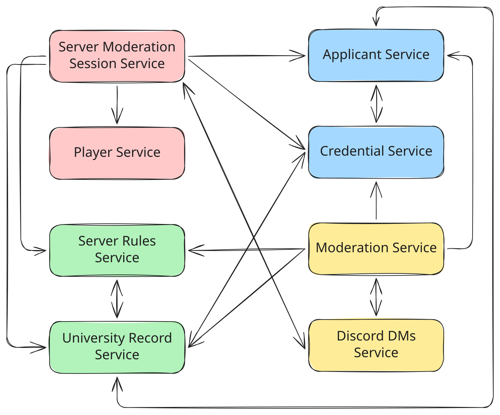

# Student ID, Please — PAD Project (Topic 3)

Team 18

## Table of Contents

- [Overview](#overview)
- [Team](#team)
- [Service Boundaries](#service-boundaries)
- [Architecture Diagram](#architecture-diagram)
- [Tech Stack & Communication Patterns](#tech-stack--communication-patterns)
- [Communication Contract](#communication-contract)
- [Development Guidelines](#development-guidelines)
- [Microservice Repositories](#microservice-repositories)
- [Project Board](#project-board)

## Overview

A Discord-server-moderation game: applicants (students, professors, alumni, outsiders — some presenting false credentials) attempt to join the university server each round. A moderation team of players must consult university records, verify credentials, check current server rules, and communicate findings before deciding to Accept, Reject, Flag, or Ban.

## Team

| Name | Group | Service 1 | Service 2 |
|---|---|---|---|
| [Mihaela Untu](https://github.com/mihaelaaa-23) | FAF-232 | Player Service | Server Moderation Session Service |
| [Ciprian Moisenco](https://github.com/ciprik13) | FAF-232 | Applicant Service | Credential Service |
| [Ion Iamandii](https://github.com/ion190) | FAF-233 | Server Rules Service | University Record Service |
| [Liviu Chirtoaca](https://github.com/D3adeYe69) | FAF-233 | Moderation Service | Discord DMs Service |


## Service Boundaries

> One subsection per service. Each should describe what it owns, what it manages, and what it deliberately does NOT own.

### Player Service

Responsible for the identity and progression of the players who take part in moderation shifts. It owns player accounts, authentication credentials, and public profiles (moderator handle, avatar), along with the player's friends list used to team up before a shift. It also owns XP and leveling — players gain experience from completed shifts, correct decisions, and any disciplinary actions taken against them, and level up over time based on this history.

Player Service does **not** own any moderation-session state (that belongs to Server Moderation Session Service), nor any information about the applicants trying to join the Discord server (owned by Applicant Service). It communicates with Server Moderation Session Service to let players join available sessions and receives shift results at the end of each session to update XP and levels accordingly.

### Server Moderation Session Service

Owns the lifecycle of an active moderation shift — one Moderator plus several Junior Moderators working a shift together. It is responsible for creating and joining sessions, assigning the Moderator/Junior Moderator roles, and starting/ending shifts. It tracks the current applicant being reviewed, how many applications have been processed so far, and a running session score with any penalties incurred during the shift. At the end of a shift, it determines the overall session result and publishes it so Player Service can update player progression.

This service does **not** store any persistent player data (accounts, XP, friends — that's Player Service), nor does it own applicant, credential, or rule data. It coordinates a shift by pulling in information from Applicant Service, Credential Service, Server Rules Service, and University Record Service as each applicant comes through.

### Applicant Service

Owns the people attempting to access the Discord server. It generates applicants with attributes such as name, student ID, major, year, university status, courses, and role (student, teaching assistant, staff, alumnus, or outsider). Some applicants are deliberately generated with false information or as impersonation attempts. If it's the first service contacted for a new applicant, it initializes that applicant's profile and propagates the relevant data to Credential Service and University Record Service; otherwise, it builds its own record from whichever service initialized the applicant first.

It does **not** own credential documents (Credential Service) or hidden university records (University Record Service), and it does **not** decide whether an applicant is admitted (Moderation Service).

### Credential Service

Owns the documents and credentials an applicant presents — student ID, university email, enrollment confirmation, course registration, and similar. Credentials can be expired, forged, inconsistent, or incomplete. It validates the structure and authenticity of what's presented, but it does not decide whether the applicant should be let in. Like Applicant Service, whichever of the two is contacted first for a new applicant initializes the shared data and propagates it to the other.

It does **not** own the applicant's general profile (Applicant Service) or the actual admission decision (Moderation Service).

### Server Rules Service

Owns the current access rules for the Discord server — rules that can change between shifts and grow arbitrarily complex (e.g. "only FAF students may join," "first-years can't access certain channels," "previously banned students are never re-admitted"). Its core job is evaluating a given applicant against whatever the current rule set is.

It does **not** store applicant data itself (Applicant Service), university records (University Record Service), or make the final Accept/Reject/Flag/Ban call (Moderation Service) — it only reports whether an applicant passes or fails the current rules.

### University Record Service

Owns the hidden university information moderators may need to verify an applicant: enrollment lists, Outlook group/email lists, current course catalog, academic year, and semester schedule. This information is deliberately fragmented across Junior Moderator players — one might see the enrollment list, another the message records — and the service must enforce that players can't access records they weren't assigned to see. As with Applicant/Credential Service, whichever service is contacted first for a new applicant initializes the record and propagates it onward.

It does **not** own the applicant's public profile (Applicant Service) or credentials (Credential Service), and it does not enforce server rules itself (Server Rules Service).

### Moderation Service
Provides real-time communication between the Moderator and Junior Moderators during a session, through a Discord-like WebSocket interface. It manages channels tied to the current moderation session (e.g. #enrollment-check, #faculty-check, #course-registration, #general-mod-chat), with different players able to access different channels depending on what information they've been assigned.

It transports messages but does **not** determine whether the information shared is correct, and it does not own any applicant, credential, or rule data itself — it's purely the communication layer.

### Discord DMs Service
Owns the actual admission decision for each applicant. The Moderator chooses Accept, Reject, Flag (for further investigation), or Ban, and the service gathers the relevant information from Applicant, Credential, Server Rules, and University Record Services to determine whether the decision was correct under the current rules. It records the applicant, the decision made, any rules violated, penalties applied, and the outcome.

It does **not** generate or store applicant/credential/record data itself, and it does not handle the real-time communication between players (Discord DMs Service) — it only consumes information and produces a verdict.

## Architecture Diagram



**Service Relationships**

Server Moderation Session Service acts as the central coordinator during an active shift. It queries Applicant Service for the current applicant, Credential Service to check submitted documents, Server Rules Service to evaluate the applicant against current access rules, and University Record Service to pull any hidden records needed for verification. Once a shift ends, it publishes the result to Player Service so XP and levels can be updated.

Moderation Service independently gathers the same four services — Applicant, Credential, Server Rules, and University Record — to determine whether the Moderator's decision (Accept, Reject, Flag, or Ban) was correct under the current rules. It does not talk to Player Service or Session Service directly; it only consumes applicant-side data to produce a verdict.

Applicant Service, Credential Service, and University Record Service share a mutual initialization pattern: whichever of the three is contacted first for a new applicant creates that applicant's record and propagates the relevant data to the other two. This is why all three are connected to each other rather than routing through a single source of truth.

Server Rules Service and University Record Service communicate directly as well, since rule evaluation can require checking specific university records (e.g. enrollment length, prior ban status) rather than relying only on what the applicant presents.

Discord DMs Service is tied to the active session: it provides the real-time channels (`#enrollment-check`, `#faculty-check`, etc.) that Junior Moderators use to share findings during a shift, and it exchanges session context bidirectionally with Server Moderation Session Service. Moderation Service also communicates with Discord DMs Service, since the Moderator's final decision needs to be relayed back to the team through chat.

Player Service sits at the edge of this graph — it only receives shift outcomes from Session Service and has no direct relationship with the applicant-side services (Applicant, Credential, Server Rules, University Record) or with Moderation Service.

## Tech Stack & Communication Patterns

> Languages used by the team: **Node.js** + **Go**. Note: Python is our team's "banned language" (a language known by everyone on the team, excluded from use in any private microservice per the assignment rules), so it is not used in any service below.

**Node.js**

Used for Player Service, Server Moderation Session Service, Applicant Service, Credential Service, Server Rules Service, and University Record Service. These are CRUD and validation-heavy with no real concurrency needs. Node's flexible object handling fits the loosely-shaped JSON these services pass around, and Express keeps boilerplate low as rules and applicant types keep expanding.

**Go**

Used for Moderation Service and Discord DMs Service. Moderation Service calls four other services per decision and must stay responsive under concurrent sessions — goroutines handle that fan-out cheaply. Discord DMs Service keeps many per-channel WebSocket connections open per shift; Go's goroutine-per-connection model is built for exactly that.

## Communication Contract
 
### Data management approach
 
Database-per-service: each service owns its own database, and no service reads another's database directly. All cross-service data access goes through the owning service's API.
 
### Endpoints
 
#### Player Service
| Method | Path | Request | Response |
|---|---|---|---|
| POST | /players/register | `{username: string, email: string, password: string}` | `{playerId: string, username: string, level: int, xp: int}` |
| POST | /players/login | `{username: string, password: string}` | `{token: string, playerId: string}` |
| GET | /players/{id} | — | `{playerId: string, username: string, level: int, xp: int, friends: string[]}` |
| PATCH | /players/{id}/xp | `{xpGained: int, reason: string}` | `{playerId: string, xp: int, level: int}` |
 
#### Server Moderation Session Service
| Method | Path | Request | Response |
|---|---|---|---|
| POST | /sessions | `{moderatorId: string, juniorIds: string[]}` | `{sessionId: string, status: string}` |
| POST | /sessions/{id}/join | `{playerId: string, role: string}` | `{sessionId: string, role: string, status: string}` |
| GET | /sessions/{id} | — | `{sessionId: string, currentApplicantId: string, processedCount: int, score: int, status: string}` |
| POST | /sessions/{id}/end | — | `{sessionId: string, result: string, score: int}` |
 
#### Applicant Service
| Method | Path | Request | Response |
|---|---|---|---|
| POST | /applicants/generate | — | `{applicantId: string, name: string, studentId: string, major: string, year: int, role: string, status: string}` |
| GET | /applicants/{id} | — | `{applicantId: string, name: string, studentId: string, major: string, year: int, role: string, status: string}` |
 
#### Credential Service
| Method | Path | Request | Response |
|---|---|---|---|
| GET | /credentials/{applicantId} | — | `{applicantId: string, studentIdCard: string, universityEmail: string, valid: boolean, issues: string[]}` |
| POST | /credentials/{applicantId}/validate | — | `{applicantId: string, valid: boolean, issues: string[]}` |
 
#### Server Rules Service

| Method | Path | Request | Response |
|---|---|---|---|
| GET | /rules/current | — | `{rules: [{id: string, description: string}]}` |
| POST | /rules/evaluate | `{applicantId: string}` | `{passed: boolean, violatedRules: string[]}` |

#### University Record Service

| Method | Path | Request | Response |
|---|---|---|---|
| GET | /records/{applicantId} | `{requestingPlayerId: string}` | `{applicantId: string, fields: object}` (scoped to player's access) |
 
#### Moderation Service

| Method | Path | Request | Response |
|---|---|---|---|
| POST | /moderation/decide | `{sessionId: string, applicantId: string, decision: string}` | `{decisionId: string, correct: boolean, violatedRules: string[], penalty: int}` |
| GET | /moderation/{decisionId} | — | `{decisionId: string, applicantId: string, decision: string, correct: boolean, violatedRules: string[], penalty: int}` |
 
#### Discord DMs Service

| Method | Path | Request | Response |
|---|---|---|---|
| WS | /ws/sessions/{id}/channels/{channel} | `{senderId: string, content: string}` | broadcasts `{senderId: string, content: string, timestamp: string}` |
| GET | /sessions/{id}/channels | — | `{channels: string[]}` (visible to requesting player) |

## Development Guidelines
 
### Git Workflow & Branch Strategy
 
We use a **Main + Development branch** model: `main` is protected and always reflects the last completed lab; `dev` is the shared integration branch where all feature work lands before being promoted to `main`.
 
```
main (protected — reflects last completed lab)
└── dev (integration branch)
    ├── feat/lab-X-service-name (short-lived feature branches)
    ├── fix/issue-description (short-lived fix branches)
    ├── docs/update-description (short-lived documentation branches)
    └── chore/task-description (short-lived maintenance branches)
```
 
### Branch Naming Convention
 
- **Feature branches:** `feat/lab-X-service-name` — e.g. `feat/lab-1-player-service`, `feat/lab-2-credential-service`
- **Fix branches:** `fix/issue-description` — e.g. `fix/session-timeout-bug`
- **Documentation branches:** `docs/update-description` — e.g. `docs/api-contract-updates`
- **Chore branches:** `chore/task-description` — e.g. `chore/setup-docker-compose`
### Versioning
 
Lab-based versioning: `v{lab}.{iteration}.{patch}`
 
- Lab completion: `v0.0.0` (this lab), `v1.0.0`, `v2.0.0`, etc.
- Feature iterations: `v1.1.0`, `v1.2.0`
- Bug fixes: `v1.0.1`, `v1.0.2`
### Lab Completion Process
 
- All feature branches for a lab merge into `dev` first
- Once a lab's requirements are complete on `dev`, open a PR from `dev` into `main`
- Tag completion on `main`: `git tag vX.0.0`
- Apply any fixes requested during evaluation on `dev`, then re-promote to `main`
### Merge Strategy
 
- **Feature branches → dev:** Squash and merge
- **dev → main:** Squash and merge, only at lab completion
- **PR approvals required:** 1 team member minimum
### Test Coverage
 
No code exists yet as of Lab 0, so no coverage threshold is enforced at this stage. Once implementation starts in Lab 1, each service is expected to have unit tests for its core business logic (e.g. rule evaluation in Server Rules Service, decision logic in Moderation Service), with a minimum coverage target to be agreed on and documented once the first service is implemented.
 
### Conventional Commits
 
We use the [Conventional Commits](https://www.conventionalcommits.org/) specification for commit messages and PR titles: `<type>(scope): brief description of changes` — e.g. `docs(readme): add service boundaries`, `feat(player-service): add registration endpoint`.
 
### Pull Request Template
 
```
## What?
[what exactly did you do in this PR]
 
## Why?
[why was this done]
 
## How?
[how did you implement it]
 
## Testing?
[how can a teammate verify this works]

## Screenshots
[optional]
 
## Anything Else?
[anything reviewers should know]
```
 
### Code Review Process
 
- **Minimum approvals:** 1 team member
- **Automated checks:** all pipelines must pass (once CI is set up)
- **Review criteria:** code quality/readability, adherence to the Communication Contract, naming conventions, adherence to the test coverage expectations above once implementation starts


## Microservice Repositories

| Service | Private repo link | Submodule path |
|---|---|---|
| Player Service | https://github.com/mihaelaaa-23/player-service | `services/player-service` |
| Server Moderation Session Service | https://github.com/mihaelaaa-23/server-moderation-session-service | `services/server-moderation-session-service` |
| Applicant Service | https://github.com/ciprik13/applicant-service | `services/applicant-service` |
| Credential Service | https://github.com/ciprik13/credential-service | `services/credential-service` |
| Server Rules Service | https://github.com/ion190/server-rules-service | `services/server-rules-service` |
| University Record Service | https://github.com/ion190/university-record-service | `services/university-record-service` |
| Moderation Service | https://github.com/D3adeYe69/Moderation-Service | `services/moderation-service` |
| Discord DMs Service | https://github.com/D3adeYe69/Discord-DMs-Service | `services/discord-dms-service` |

## Project Board

- Project Board: [Link to GitHub Project](https://github.com/users/mihaelaaa-23/projects/4)